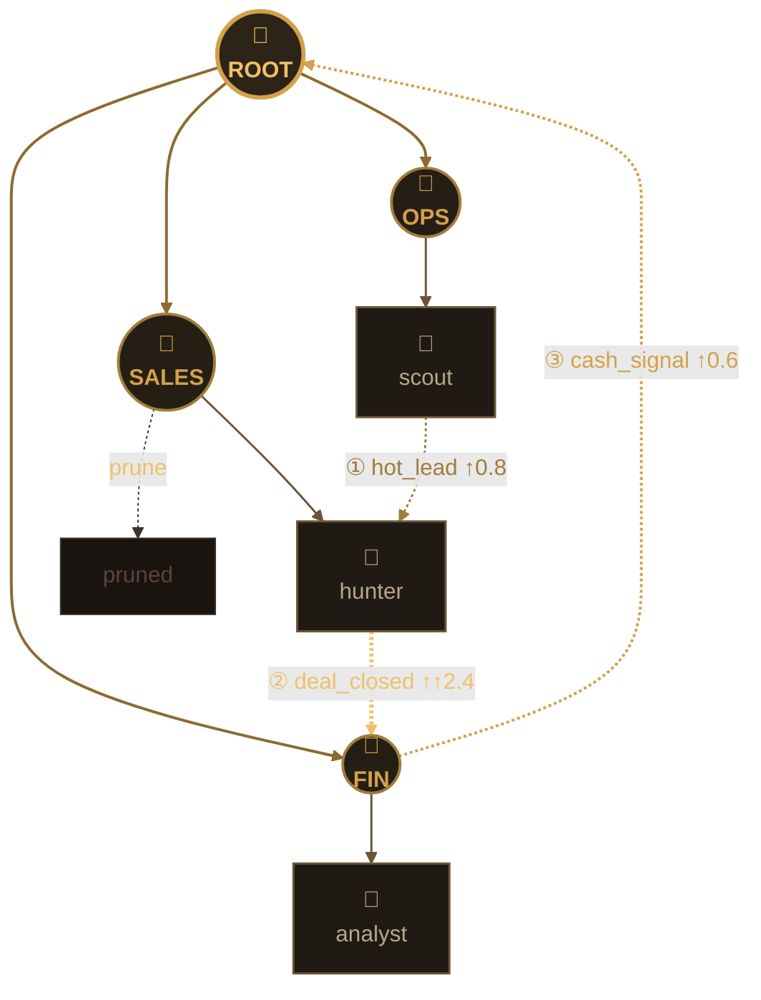
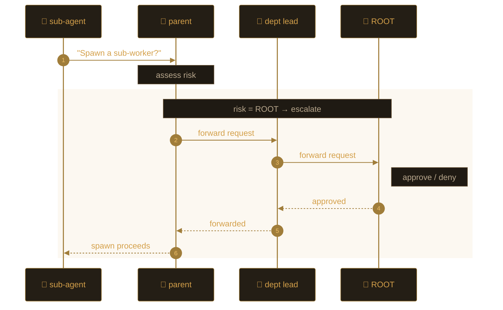
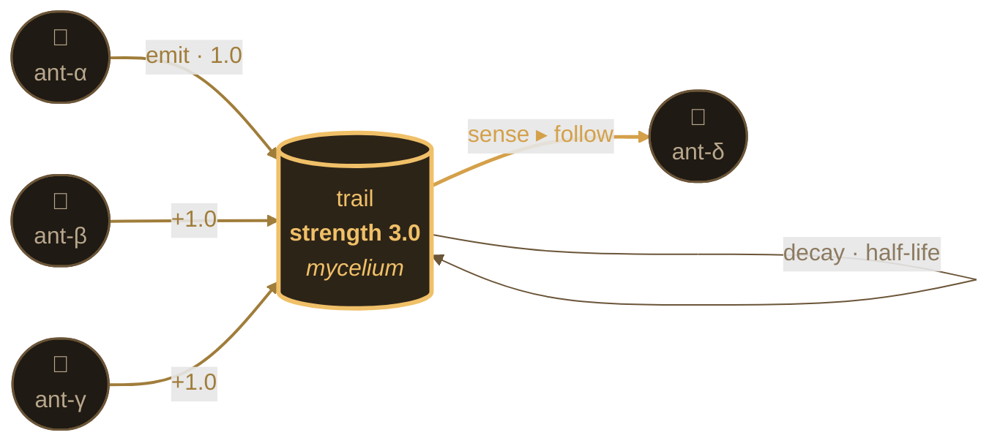
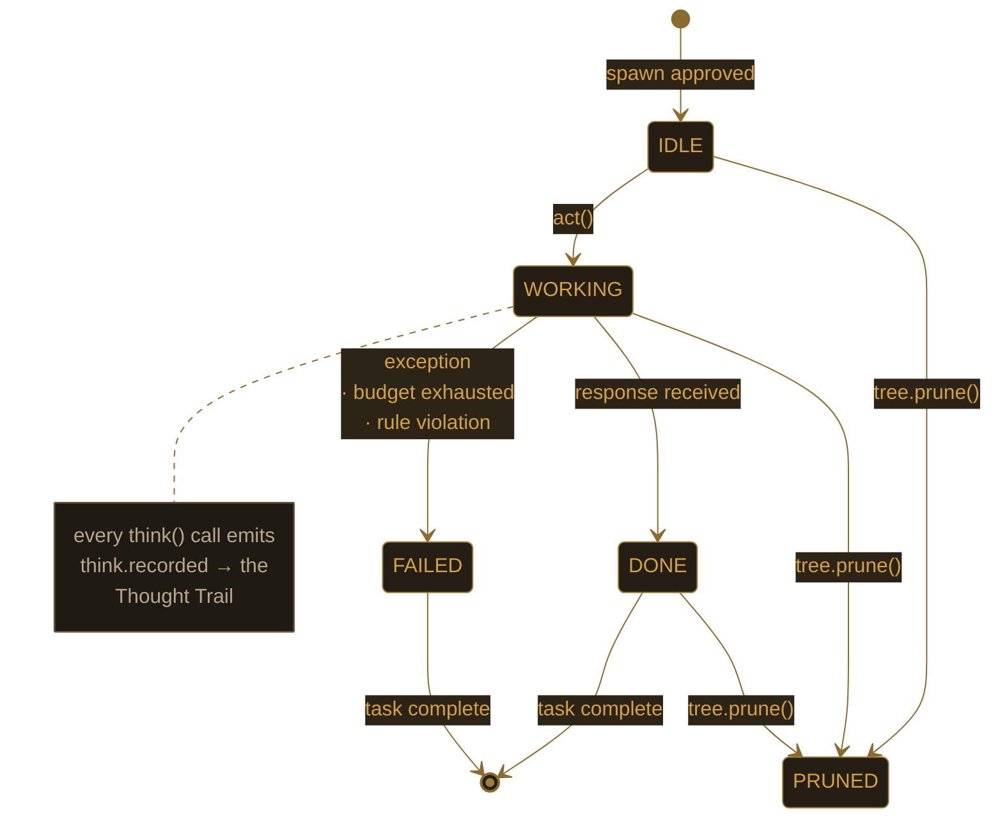

<div align="center">

# 🐜 Ormica
### An Autonomous Coordination Engine
> **Seed the colony. Let the organization emerge.**

[](LICENSE)
[](https://www.python.org/downloads/)
[]()
[]()
[]()

</div>

---

> Traditional AI systems are **machines** — programmed to perform tasks until they fail.
> **Ormica is a cybernetic organism** — designed to evolve within your business architecture.

Ormica is an **open-source coordination framework** for building agentic systems that scale through biological principles. Instead of brittle chains or static pipelines, it provides the *infrastructure* to **spawn**, **signal**, **prune**, and **govern** a living hierarchy of AI agents.

---

## 🗺️ The Living Colony



<sub>**Every node is an ant.** Solid arrows = spawn hierarchy. Dashed amber arrows = pheromone trails. ① **scout** senses a hot lead and signals **hunter** → ② **hunter** closes the deal and signals **finance** → ③ **finance** reports cash back to **root**. One sensing pathway, full closed loop, decay-prunes the dead branch. *Brightness = signal intensity. Thickness = reinforcement count.*</sub>

**Solid arrows** = the spawn hierarchy. Every node has a parent. Every spawn was approved.
**Dashed trails** = stigmergic signals — pheromone trails, with intensity. Strong trails dominate, weak ones decay, dead branches are pruned.
**You stay at the root.** The colony grows beneath you.

---

## 🧬 The Ormica Philosophy: *"Computational Stigmergy"*

Four biological principles, one architecture.

### 🌲 Emergent Hierarchy — `arbor`
You define the *goals*; the framework grows the *tree*. Agents are spawned dynamically to meet demand, creating a depth-first hierarchy that is as complex or as simple as the task requires. No fixed graphs. No predefined chains.

### 🐜 Stigmergic Coordination — `stigma` + `mycelium`
Agents do not rely on fragile message-passing. They post state, intent, and progress to a **shared digital pheromone field**. Other agents detect strong trails and follow; weak signals evaporate. Coordination is *emergent*, not orchestrated.

### 🏛️ Permission Chain — `canopy`
The engine prevents agent runaway. **Every sub-agent birth** must pass through a permission gate — `AUTO` (parent alone), `CHAIN` (N ancestors), or `ROOT` (only you). High-risk growth propagates all the way to the human owner. The colony remains aligned with your core directives.

### ⚖️ Constitutional Governance — `cortex`
The colony's *law*. Hard constraints and soft policies encoded as `Rule` objects. Where the **brain** generates a response, the **cortex** decides whether it's permissible. Anatomically and architecturally: the brain *acts*; the cortex *inhibits*.

### 🍄 Persistent Memory — `mycelium`
The colony maintains a shared underground network of knowledge. Agents read and write to this state-layer with full author tags, timestamps, and TTL. Pluggable backends (`FileBackend`, `SqliteBackend`) keep state across process restarts. **The system learns from its own history rather than starting from zero.**

### 📡 The Thought Trail — `observe`
Every reasoning step — messages, tool calls, response, tokens — captured and tied to the task that triggered it. Not just *what* happened, but *why the colony chose that path*. Queryable via `org.trace_for(task_id)`. The Black-Box Problem, solved.

---

## 🏗️ Why this is a *Framework*, not just *Software*

| | What you'd normally write | What Ormica gives you |
|---|---|---|
| 🧠 **You provide** | Individual agent actions, prompts, glue code | The *intent* — a colony config + a few tools |
| 🦴 **Ormica provides** | (you wire it together) | **The nervous system** — `arbor`, `stigma`, `mycelium`, `cortex`, `observe` |
| 🏥 **Industry** | Hard-coded for one domain | **Industry-agnostic core** — same engine runs a hospital, a supply chain, a solo founder, just by swapping a colony |
| 💬 **Failure model** | "Catch and retry" | **Bounded blast radius** — a failed task ≠ a dead colony; a prunable branch ≠ tree death |
| 🔭 **Observability** | Logs you grep later | **Thought Trail** — structured per-task reasoning capture, persisted |

You're not writing the colony. You're writing the colony's *constitution*.

---

## 🔬 Engineered for Distributed Systems

Multi-agent AI hits the same problems distributed systems solved 40 years ago. Ormica answers each one explicitly:

| Distributed-systems problem | Ormica's answer |
|---|---|
| Coordination without central commands | **Stigmergy** — agents read/write a shared signal field; strong trails reinforce, weak ones decay |
| Bounded growth | **Permission chain** on every spawn (AUTO / CHAIN / ROOT); root owner is the final authority |
| Failure isolation | A failed task marks *itself* failed; the run continues |
| State persistence | Pluggable `Backend` — `FileBackend` (JSON), `SqliteBackend` (WAL). Memory survives restarts |
| Scheduling fairness | Priority bands (`high` → `normal` → `low`) run sequentially; same-band tasks fan out concurrently |
| Governance & safety | **Constitutional cortex** — hard constraints enforced regardless of LLM output |
| Auditability | **Thought Trail** — per-task capture of every reasoning step + tool call |

This is the framing that separates a lab experiment from **infrastructure a CTO would actually trust**.

---

## 🚀 30-Second Taste

```python
from ormica import Ormica
from ormica.brain import ClaudeBrain
from ormica.cortex import Constitution, Rule

# 1. Encode the law of the colony
constitution = Constitution([
    Rule(name="depth_cap",
         description="never grow past depth 4",
         check=lambda ctx: ctx["depth"] <= 4, stage="spawn"),
])

# 2. Seed the colony
org = Ormica("My SaaS", owner="Founder",
             constitution=constitution,
             memory_db="./acme.db")     # state survives restarts
org.plant("business")                    # 4 departments emerge under root

# 3. Queue intent (not implementation)
org.task("Reach out to 3 SMB leads", dept="sales", priority="high")
org.task("Forecast Q3 cash flow",     dept="finance")

# 4. Let the organization emerge
org.run(brain=ClaudeBrain())
```

…or from a terminal:

```bash
ormica init "My SaaS" --industry business --brain claude
ormica run --async --concurrency 5
```

Five lines from "no colony" to "running, signal-driven, governed, audited."

---

## 📡 How the Colony Behaves — Three Living Diagrams

### 1. The Permission Chain — *why growth is bounded*



Three risk levels: **AUTO** · **CHAIN** · **ROOT**. Configure per role:
`RoleRisk({"finance": ROOT, "scout": AUTO})`. See [docs/architecture/01-hierarchy.md](./docs/architecture/01-hierarchy.md).

### 2. The Pheromone Field — *coordination without chat*



Reinforced trails dominate. Weak trails evaporate. **Persistence is automatic** — restart the process and the field is still there (if you used a persistent backend).

### 3. Agent State Topology — *every node has a known phase*



Every transition emits an event onto the colony's bus. A `TraceObserver` aggregates them per task — that's the **Thought Trail**.

---

## 🩺 The Colony Health Report

`ormica status` — the colony's vital signs without running anything.

```text
$ ormica status

name:     My SaaS
owner:    Ranzim
industry: business
brain:    claude (model=claude-opus-4-7)

tree (5 nodes):
  - My SaaS [root]
    - operations  [operations]
    - sales       [sales]
    - marketing   [marketing]
    - finance     [finance]

tasks queued: 2
  - [high]   sales:   Reach out to 3 SMB leads
  - [normal] finance: Forecast Q3 cash flow
```

A richer dashboard — signal intensity per topic, branch depth, governance compliance, top-N pheromone trails — is on the [roadmap](#%EF%B8%8F-roadmap) as a v0.5 web UI on top of the Thought Trail.

---

## 🆚 vs. the Alternatives

| | LangChain · CrewAI · AutoGen | **Ormica** |
|---|---|---|
| Structure | Fixed chains / graphs | **Living tree** — grows to N depth |
| Agent creation | Defined upfront | **Self-spawning** on demand |
| Growth control | None built in | **Permission chain to root** (canopy) |
| Coordination | Direct messaging | **Stigmergic signals + emergence** |
| State persistence | DIY | **Pluggable `Backend`** (file / sqlite) |
| Failure handling | Often kills the run | **Failed task ≠ dead system** |
| Governance | "Try harder prompts" | **First-class `Constitution`** (cortex) |
| Auditability | Ad-hoc logging | **Thought Trail per task** (observe) |
| Focus | General purpose | **Production agent operations** |

---

## 📦 What's Inside

```
ormica/
├── arbor/         Tree · Node · Branch · SpawnPolicy       🌲 emergent hierarchy
├── canopy/        Permission chain (AUTO · CHAIN · ROOT)   🏛️ growth governance
├── mycelium/      Shared KV + FileBackend + SqliteBackend  🍄 persistent memory
├── stigma/        Pheromone trails · lazy decay            🐜 stigmergic signals
├── brain/         LLM seam: Mock · Claude · GPT            🧠 the colony's thinking
│                  (sync + async) · Router · Tool · @tool
├── cortex/        Constitution · Rule · Policy             ⚖️ law of the colony
├── observe/       Event · EventBus · TraceObserver         📡 the Thought Trail
├── colony/        AgentTemplate · Colony · YAML loader     🏢 industry templates
│                  (business + supply_chain bundled)
├── agent.py       Agent · AsyncAgent · ToolLoopExceeded
├── runtime.py     Task · TaskRunner · AsyncTaskRunner
├── core.py        Ormica facade — single import
└── cli/           ormica init / run / status / colonies
```

```
docs/                                # the onboarding map
├── README.md                         index
├── concepts.md                       Computational Stigmergy in depth
├── getting-started.md                install + hello-world
├── architecture/                     one page per module / pillar
└── guides/                           writing colonies, tools, rules, traces…
```

`tests/` — **310 tests · ~370ms · no SDK deps required for CI.**

---

## 🛣️ Roadmap

- [x] **v0.1** — Four pillars + runtime + CLI + persistence + async + observability *(here)*
- [ ] **v0.2** — YAML Constitutions · soft-violation events · per-node rule overrides
- [ ] **v0.3** — Async tools · streaming responses · first integrations (Gmail · Notion · GitHub · Stripe)
- [ ] **v0.4** — ChromaDB backend (semantic mycelium) · vector signals
- [ ] **v0.5** — **Colony Dashboard** (web UI) — signal intensity, branch depth, governance compliance, live Thought Trail
- [ ] **v1.0** — Ormica Cloud (hosted platform)

GitHub Project board is coming. Open an issue to vote on or contribute to any roadmap item.

---

## 🤝 Join the Colony — Contributing

The colony is young; new contributors shape its character.

### 🚀 New here? Three pages to read:

| | Page | What you'll get |
|---|---|---|
| 1 | **[Your First PR](./docs/guides/your-first-pr.md)** | The shortest path from "I want to help" to "my PR is merged." |
| 2 | **[CONTRIBUTING.md](./CONTRIBUTING.md)** | The *where-to-put-what* matrix + hard rules of the codebase. |
| 3 | **One [architecture page](./docs/architecture/README.md)** | Pick the pillar you're touching. Each page is ~5 minutes. |

### 🐜 Good first contributions

| You want to add… | Where it goes | Read first |
|---|---|---|
| 🏢 A new industry / colony | `ormica/colony/<name>/` or a YAML file | [Writing a colony](./docs/guides/writing-a-colony.md) |
| 🛠️ A new tool | wherever you use `act_with_tools(...)` | [Writing tools](./docs/guides/writing-tools.md) |
| 🧠 A new LLM provider | `ormica/brain/<provider>.py` | [Brain](./docs/architecture/03-brain.md) |
| 🍄 A persistence backend | `ormica/mycelium/<name>_backend.py` | [Persistence](./docs/guides/persistence.md) |
| 📡 A new observer (metrics, log sink) | `ormica/observe/<observer>.py` | [Observability](./docs/architecture/05-observability.md) |
| 📚 A docs improvement | `docs/` | The page itself |
| 🐛 A small bug fix | wherever the bug lives | The bug report |

### 💬 Other ways to help

- 📌 **Browse open issues** — look for [`good first issue`](https://github.com/Ranzim/ormica/issues?q=is%3Aissue+is%3Aopen+label%3A%22good+first+issue%22) or [`help wanted`](https://github.com/Ranzim/ormica/labels/help%20wanted).
- 💭 **Open a Discussion** — questions, ideas, show-and-tell at [GitHub Discussions](https://github.com/Ranzim/ormica/discussions).
- ⭐ **Star the repo** — visibility helps new contributors find us.
- 📣 **Share your colony** — tag the project when you build something cool.

### 🧪 Before you push

```bash
pytest              # 310 tests, ~370ms, all green
ruff check .        # lint clean
```

By participating, you agree to abide by the [Code of Conduct](./CODE_OF_CONDUCT.md). To report a security issue, see [SECURITY.md](./SECURITY.md).

---

## 🏷️ Recommended GitHub Topics

When tagging the repo (Settings → "Manage topics"):

```
ai · agents · agentic · multi-agent · multi-agent-framework
distributed-systems · stigmergy · swarm-intelligence
cybernetics · self-organization · emergence
llm · autonomous-agents · python · framework
```

Positions Ormica where it belongs: **systems engineering**, not "another AI agent chatbot."

---

## 📜 License

MIT — see [LICENSE](LICENSE). Free to use, modify, and build on.

---

<div align="center">

**Ormica** — *organize like a colony · grow like a forest · decide like an organization · audit like infrastructure.*

<sub><i>Computational Stigmergy · v0.1 · ant-colony-inspired coordination for autonomous AI operations</i></sub>

</div>
