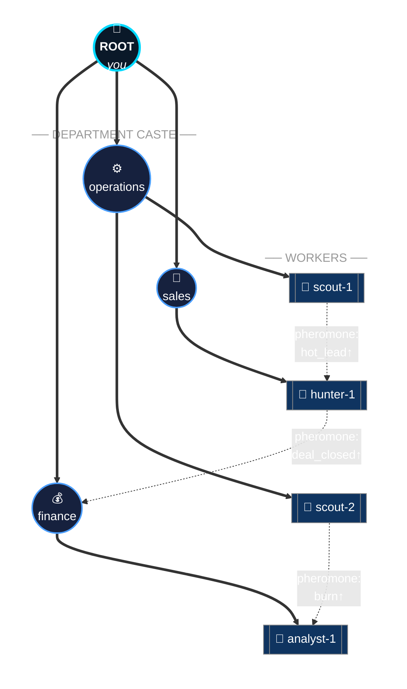
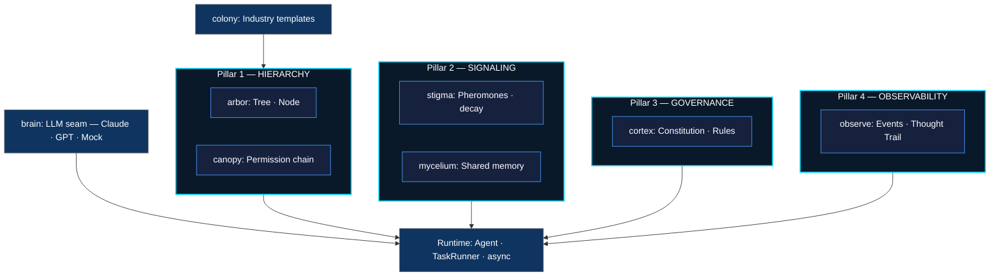
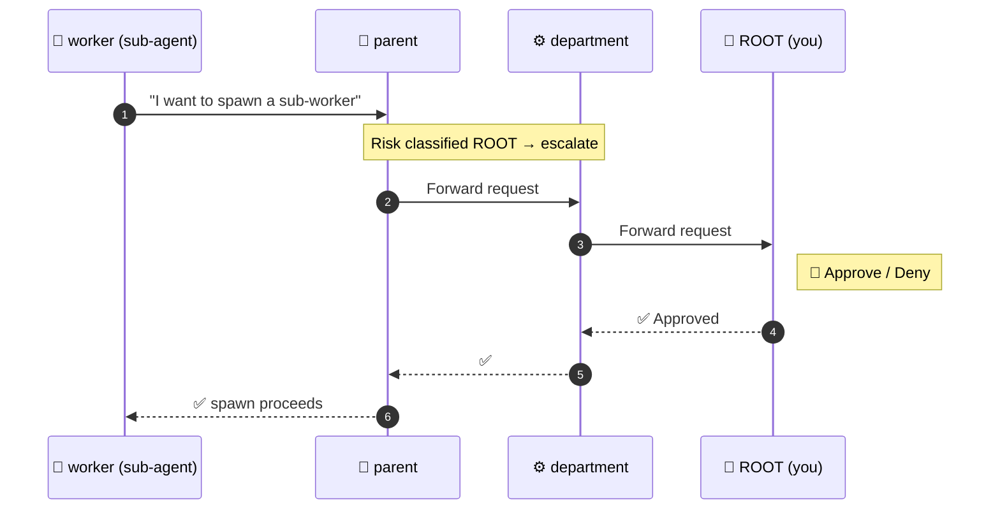
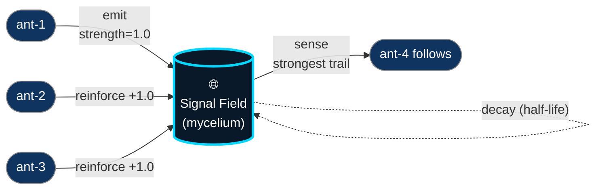
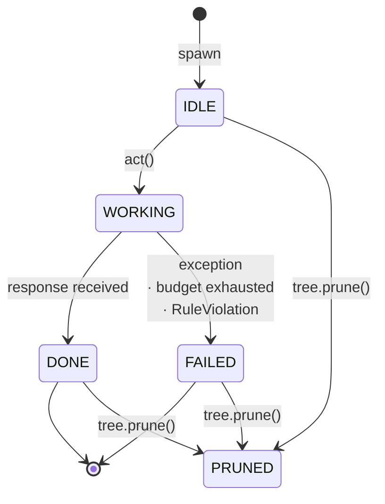

<div align="center">

# 🐜 Ormica

### Build agentic software that organizes itself — like an ant colony.

*Not pipelines. Not chains. **A living hierarchy of AI agents** that spawns, signals, prunes, and grows — with every decision traceable back to root.*

[](LICENSE)
[](https://www.python.org/downloads/)
[]()
[]()

</div>

---

## 🗺️ The Colony, at a glance



Solid arrows = the **hierarchy** (every node has a parent; every spawn is permission-checked).
Dashed arrows = **pheromone signals** (agents coordinate by reading/writing a decaying signal field, not by direct messages).
You — the human owner — stay at the root. The colony grows beneath you.

---

## ⚡ Why Ormica?

> **Ormica is a distributed systems framework — the AI part is the user-facing layer.**

Building production multi-agent AI hits the same problems distributed systems solved 40 years ago. Ormica answers each one explicitly:

| Distributed systems problem | Ormica's answer |
|---|---|
| Coordination without central commands | **Stigmergy** — agents read/write a shared signal field; strong trails reinforce, weak ones decay |
| Bounded growth | **Permission chain** on every spawn (AUTO / CHAIN / ROOT); root owner is the final authority |
| Failure isolation | A failed task marks *itself* failed; the run continues. One bad agent ≠ a dead system |
| State persistence | Pluggable `Backend` — `FileBackend` (JSON), `SqliteBackend` (WAL). Memory survives restarts |
| Scheduling fairness | Priority bands (`high` → `normal` → `low`) run sequentially; same-band tasks fan out concurrently |
| Governance & safety | **Constitutional cortex** — hard constraints enforced regardless of LLM output |
| Auditability | **Thought Trail** — per-task capture of every reasoning step + tool call, queryable by id |

That's what separates a lab experiment from infrastructure a CTO would actually trust.

---

## 🚀 30-second taste

```python
from ormica import Ormica
from ormica.brain import ClaudeBrain

org = Ormica("My SaaS", owner="Founder")
org.plant("business")                      # 4 departments — ops/sales/marketing/finance

org.task("Follow up with 3 leads", dept="sales", priority="high")
org.task("Forecast Q3 cash flow",   dept="finance")

org.run(brain=ClaudeBrain())
# → priority-ordered; sales runs first; results land in shared memory
```

Or from the shell:

```bash
ormica init "My SaaS" --industry business --brain claude
ormica run --async --concurrency 5
```

---

## 🏛️ The four pillars

The framework is built on **four functional pillars** plus a small runtime layer. Each pillar exists for one reason and exposes one minimal API.



| Pillar | Module(s) | One-line role | Read |
|---|---|---|---|
| 1️⃣ **Hierarchy** | `arbor` · `canopy` | Tree of agents + permission chain on growth | [docs](./docs/architecture/01-hierarchy.md) |
| 2️⃣ **Signaling** | `mycelium` · `stigma` | Shared signal field + pheromone trails | [docs](./docs/architecture/02-signaling.md) |
| 3️⃣ **Governance** | `cortex` | Constitution: rules that gate every action | [docs](./docs/architecture/04-governance.md) |
| 4️⃣ **Observability** | `observe` | Events + Thought Trail (every think captured) | [docs](./docs/architecture/05-observability.md) |

Runtime layer: `brain` (LLM seam) · `agent.py` · `runtime.py` (Task/Runner) · `colony` (industries) · `cli`.

---

## 🌊 How the four pillars compose — three quick visuals

### 1. Permission chain — why growth is bounded



Three risk levels: **AUTO** (parent alone), **CHAIN** (N ancestors), **ROOT** (only you). Set per role: `RoleRisk({"finance": ROOT, "scout": AUTO})`. See [canopy](./docs/architecture/01-hierarchy.md).

### 2. Stigmergic signal field — coordination without chat



Strong trails dominate. Weak ones evaporate. Agents coordinate without ever messaging each other directly — and the field persists across process restarts when you use `SqliteBackend`.

### 3. Agent state machine — every node has a known state



Every transition emits an event onto the bus. A `TraceObserver` aggregates them per task — that's the **Thought Trail**.

---

## 🧬 The biological metaphors

Three concepts fused into one framework — plus a fourth layer that makes the result production-safe.

| Concept | What it gives Ormica | Module |
|---|---|---|
| 🐜 **Ant colony intelligence** (stigmergy) | Coordination through signals, not central commands. Intelligence emerges from simple local rules. | `stigma` + `mycelium` |
| 🌲 **Random forest structure** | Many branches explore a problem in parallel, each from a different angle, growing to any depth. | `arbor` |
| 🏛️ **Organizational theory** | A permission chain controls growth. Every new agent is approved up the hierarchy — like hiring in a real company. | `canopy` |
| 🧠 **Constitutional governance** | Hard constraints encoded as `Rule` objects. The brain *generates*; the cortex *constrains*. | `cortex` |

Read the full philosophy in [`docs/concepts.md`](./docs/concepts.md).

---

## 🆚 vs. the alternatives

| | LangChain · CrewAI · AutoGen | **Ormica** |
|---|---|---|
| Structure | Fixed chains / graphs | Living tree, grows to N depth |
| Agent creation | Defined upfront | Self-spawning on demand |
| Growth control | None built in | Permission chain to root |
| Coordination | Direct messaging | Stigmergic signals + emergence |
| State persistence | DIY | Pluggable `Backend` (file / sqlite) |
| Failure handling | Often kills the run | Failed task ≠ dead system |
| Governance | "Try harder prompts" | First-class `Constitution` |
| Auditability | Ad-hoc logging | Thought Trail per task |
| Focus | General purpose | **Production agent operations** |

---

## 📦 What's inside

```
ormica/
├── arbor/         Tree · Node · Branch · SpawnPolicy        🌲 hierarchy
├── canopy/        Permission chain (AUTO · CHAIN · ROOT)    🏛️ governance of growth
├── mycelium/      Shared KV + FileBackend + SqliteBackend   🍄 shared memory
├── stigma/        Pheromone trails · lazy decay             🐜 signaling
├── brain/         LLM seam: Mock · Claude · GPT (sync+async) 🧠 thinking
│                  + Router + TokenBudget + @tool
├── cortex/        Constitution · Rule · ConstitutionPolicy  ⚖️ law of the colony
├── observe/       Event · EventBus · TraceObserver           📡 Thought Trail
├── colony/        AgentTemplate · Colony · YAML loader      🏢 industries
│                  (business + supply_chain bundled)
├── agent.py       Agent · AsyncAgent · ToolLoopExceeded
├── runtime.py     Task · TaskRunner · AsyncTaskRunner
├── core.py        Ormica facade — single import
└── cli/           ormica init / run / status / colonies
```

```
docs/                                # the onboarding map
├── README.md                         index + table of contents
├── concepts.md                       3 metaphors + production layer
├── getting-started.md                install + hello-world
├── architecture/                     one page per module
│   ├── 01-hierarchy.md ... 08-facade.md
└── guides/                           task-focused how-tos
    ├── writing-a-colony.md
    ├── writing-tools.md
    ├── writing-a-constitution.md
    ├── reading-the-thought-trail.md
    ├── persistence.md
    └── async-and-routing.md
```

```
tests/                                310 tests · ~370ms · no SDK deps required
```

---

## 🛣️ Roadmap

- [x] **v0.1** — Four pillars + runtime + CLI + persistence + async + observability *(here)*
- [ ] **v0.2** — YAML-defined Constitutions; soft-violation events; per-node Constitution overrides
- [ ] **v0.3** — Async tools; streaming responses; integrations (Gmail · Notion · GitHub · Stripe)
- [ ] **v0.4** — ChromaDB backend (semantic memory); vector signals
- [ ] **v0.5** — Web dashboard for Thought Trail browsing + live event stream
- [ ] **v1.0** — Ormica Cloud (hosted platform)

GitHub Project board coming. Open issues for any roadmap item to vote / contribute.

---

## 🤝 Contributing

We're early. Contributions of all kinds are welcome — new colonies, new brain adapters, new backends, docs, demos.

- 📖 Read [`docs/`](./docs/) — pick one architecture page + one guide and you're ready.
- 🗺️ See [`CONTRIBUTING.md`](./CONTRIBUTING.md) for the *where-to-put-what* matrix and the hard rules of the codebase.
- 🧪 `pytest` — 310 tests, ~370ms. Green or your PR isn't ready.

---

## 🏷️ Recommended GitHub topics

When you tag the repo (Settings → "Manage topics"):

```
ai · agents · agentic · multi-agent · multi-agent-framework
distributed-systems · stigmergy · swarm-intelligence
llm · autonomous-agents · python · framework
```

Positions Ormica as a **systems engineering tool** — exactly the developer this project wants to attract.

---

## 📜 License

MIT — see [LICENSE](LICENSE). Free to use, modify, and build on.

---

<div align="center">

**Ormica** — *organize like a colony · grow like a forest · decide like an organization · audit like infrastructure.*

</div>
