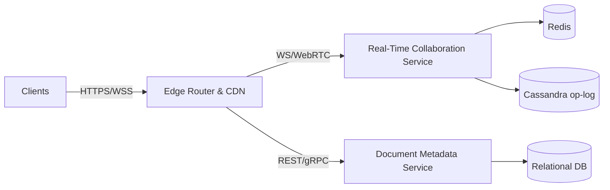

# Architect — a colony that designs real software architecture

The "use it on a genuinely hard task" example. A lead architect spawns
specialist agents (services, data, infrastructure); each — driven by a **real
LLM** — analyses the system, and the lead **synthesises** their notes into a
single, **schema-checked** architecture: components, how they connect, data
stores, and risks.

```
                    ┌─ services  ─┐
   "design X"  ──▶  ├─ data      ─┤ ──▶  lead synthesises  ──▶  validated
                    └─ infra     ─┘      (typed + grounded)      architecture
                     specialists                                  (JSON artifact)
```

Two engine strengths carry the weight:

- **a colony, not one prompt** — separate specialists reason about their slice,
  so the design has real breadth instead of one model's first idea.
- **typed + grounded output** — the final spec must parse and validate against
  the `architecture` [`ArtifactType`](../../ormica/artifact.py); if the model
  emits malformed JSON, the [verify stage](../../docs/guides/verification.md)
  feeds the exact problem back and it retries until it's right.

## Run it

```bash
# real design, from Gemini (free-tier keys work — RetryingBrain absorbs 429s)
export GEMINI_API_KEY=...
python examples/architect/run.py "a ride-hailing platform at 10M users"

# no key → offline MockBrain (canned, deterministic demo)
python examples/architect/run.py
```

It prints the architecture, and saves the full spec to `architecture.json`.

## Render it in Figma (optional)

The output is a plain, structured artifact — feed its `components` + `connections`
to any diagram tool. With the Figma integration connected, it becomes a FigJam
board (edge → services → data tiers with labelled data flows):



## Why this needs a colony (not just one prompt)

A single "design X" prompt gives you one model's first pass. Here, each concern
gets a dedicated agent, the synthesis is **contract-checked** (so downstream
tooling can rely on the shape), and the whole run is bounded and inspectable —
the difference between a chat answer and a component you can put in a pipeline.

Swap `pick_brain()` for any provider, raise the specialist count, or add a
`grounded` rule that runs a real check (e.g. "every data store is referenced by
a component") to make the design self-correct even harder.
